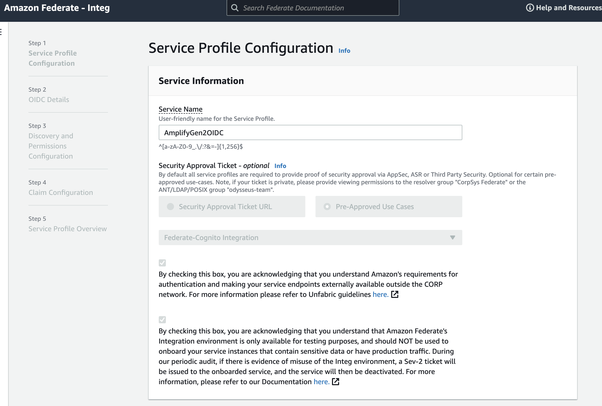
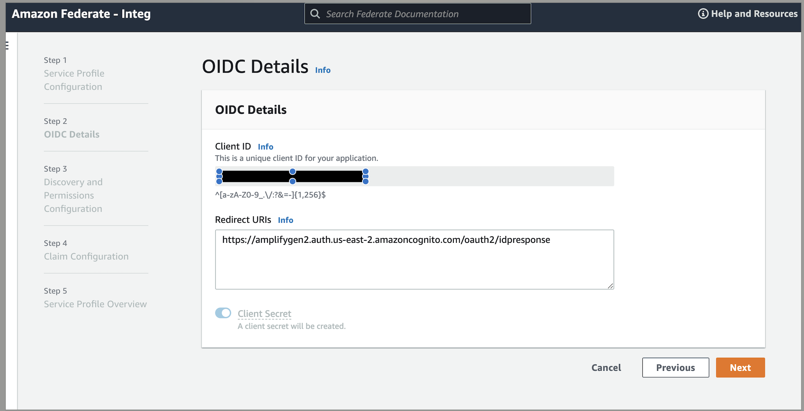
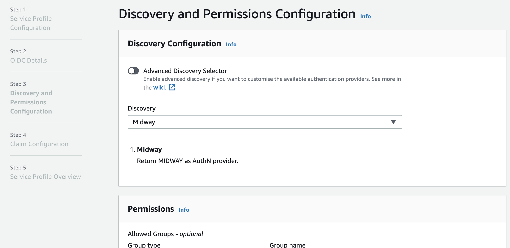
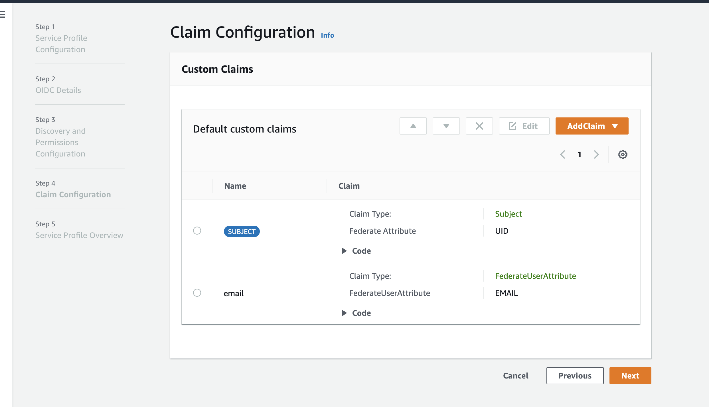
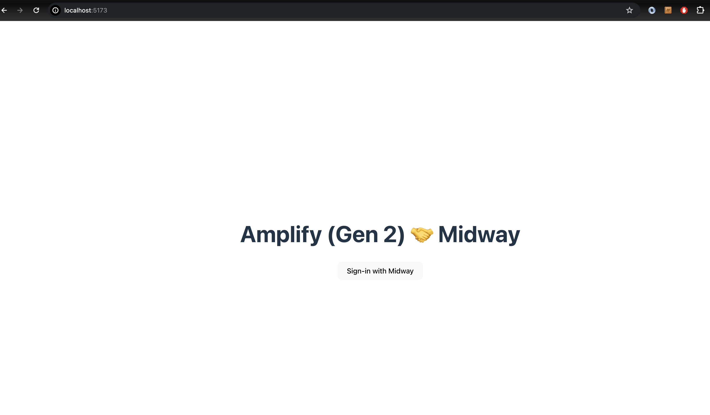
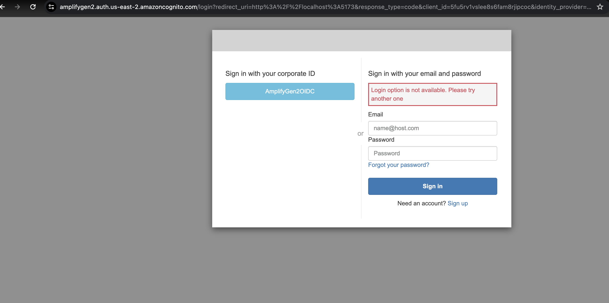
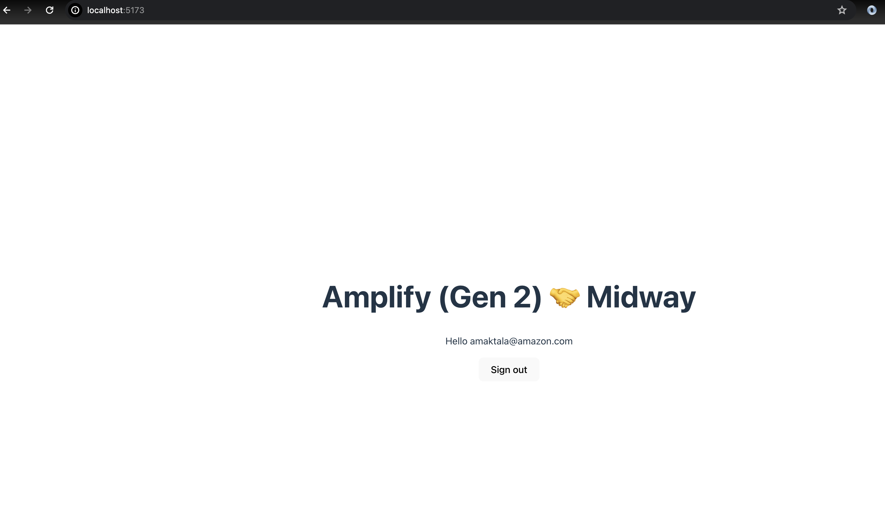

# Amplify Gen2 Auth with Amazon Federate

This project showcases the integration of Amplify Gen2 Auth with Amazon Federate (Midway/Yubi Key) as the federated authentication provider. The guide walks you through configuring the authentication backend, creating an Amazon Federate Service Profile, and updating your application to enable federated sign-in.

##Getting Started

Initialize a new Amplify Gen2 project with Vite and React TypeScript template:

```bash
$ npm create vite@latest amplify-gen2-amazon-federate -- --template react-ts
$ cd amplify-gen2-amazon-federate
$ npm install
$ npm create amplify@beta
$ npx amplify sandbox


```

This sample project uses Amplify Auth with Amazon Federate (Midway / Yubi Key) as the federated authentication provider.

## Configure Amplify Auth

To configure your auth backend, edit the `amplify/auth/resource.ts` file. You can set up sign-in mechanisms that work with either an email/phone and password combination, or through integration with social provider sign-in options.

```bash
// amplify/auth/resource.ts
import { defineAuth } from '@aws-amplify/backend';

/**
 * Define and configure your auth resource
 * When used alongside data, it is automatically configured as an auth provider for data
 * @see https://docs.amplify.aws/gen2/build-a-backend/auth
 */
export const auth = defineAuth({
  loginWith: {
    email: true,
    // add social providers
    externalProviders: {
      /**
       * First, create your secrets using `amplify sandbox secret`
       * Then, import `secret` from `@aws-amplify/backend`
       * @see https://docs.amplify.aws/gen2/deploy-and-host/sandbox-environments/features/#setting-secrets
       */
      // loginWithAmazon: {
      //   clientId: secret('LOGINWITHAMAZON_CLIENT_ID'),
      //   clientSecret: secret('LOGINWITHAMAZON_CLIENT_SECRET'),
      // }
      // callbackUrls: ['http://localhost:3000'],
      // logoutUrls: ['http://localhost:3000'],
    }
  },
  /**
   * Enable multifactor authentication
   * @see https://docs.amplify.aws/gen2/build-a-backend/auth/manage-mfa
   */
  // multifactor: {
  //   mode: 'OPTIONAL',
  //   sms: {
  //     smsMessage: (code) => `Your verification code is ${code}`,
  //   },
  // },
  userAttributes: {
    /** Request additional attributes for your app's users */
    // profilePicture: {
    //   mutable: true,
    //   required: false,
    // },
  }
});
```


Then deploy your project to AWS.

```bash
$ npx amplify sandbox
```

## Create Amazon Federate Service Profile

Logon to Amazon Federate at **https://integ.ep.federate.a2z.com/**

When creating your profile, make sure to enable a **client secret** and save the value. You will need the client id and secret to configure Cognito.



When prompted for the **redirect URI** use the domain created in the amplify auth sequence followed by _/oauth2/idpresponse_. It will look something like:

```
https://XXXXXXXXXXX.auth.us-east-1.amazoncognito.com/oauth2/idpresponse
```





You can update the /auth/resource.ts\* file with the following

```ts
import { defineAuth, secret } from "@aws-amplify/backend";

export const auth = defineAuth({
  loginWith: {
    email: true,
    externalProviders: {
      oidc: [
        {
          name: "AmplifyGen2OIDC",
          // something that makes sense to you
          clientId: secret("GEN2_OIDC_CLIENT_ID"),
          clientSecret: secret("GEN2_OIDC_CLIENT_SECRET"),
          issuerUrl: "https://idp-integ.federate.amazon.com",
          scopes: [
            "openid",
            "aws.cognito.signin.user.admin",
            "email",
            "profile",
            "phone",
          ],

          attributeMapping: {
            // username: sub???
            email: {
              attributeName: "email",
            },
          },
        },
      ],
      callbackUrls: ["http://localhost:5173"],
      logoutUrls: ["http://localhost:5173"],
      // This required value will be prepended to `.auth.us-west-2.amazoncognito.com` and used for your application's oauth url
      domainPrefix: "amplifygen2",
    },
  },
});
```

Configure the OIDC `clientId` and `clientSecret` values by executing the command `npx amplify sandbox secret set` and supplying the values employed during the creation of the federate profile at https://integ.ep.federate.a2z.com/.

```bash
npx amplify sandbox secret set GEN2_OIDC_CLIENT_ID

npx amplify sandbox secret set GEN2_OIDC_CLIENT_SECRET

```

## Update Your Application

This sample is a React app. Copy and paste the contents of the **App.tsx** file into your application's App.tsx file.

The application simply displays a Signin With Midway button if the user is not signed in. Once clicked, the button will initiate the Midway sign in sequence. Following successful authentication, the application showcases the email of the logged-in user along with a "Sign Out" button.

The name of the **customProvider** must match what you named the OIDC profile in your Cognito Federated Identities profile.

```javascript
import { useEffect, useState } from "react";
import { useAuthenticator } from "@aws-amplify/ui-react";
import { Amplify } from "aws-amplify";
import { fetchUserAttributes, signInWithRedirect } from "aws-amplify/auth";
import config from "../amplifyconfiguration.json";
import "./App.css";

Amplify.configure(config);

function App() {
  const { user, signOut } = useAuthenticator((s) => [s.user, s.signOut]);
  const [attributes, setAttributes] =
    useState<Awaited<ReturnType<typeof fetchUserAttributes>>>();

  useEffect(() => {
    if (user) fetchUserAttributes().then(setAttributes);
  }, [user]);

  return (
    <>
      <h1>Amplify (Gen 2) 🤝 Midway</h1>
      {attributes ? (
        <>
          <p>Hello {attributes.email}</p>
          <button onClick={() => signOut()}>Sign out</button>
        </>
      ) : (
        <button
          onClick={() => signInWithRedirect({ provider: { custom: "Midway" } })}
        >
          Sign-in with Midway
        </button>
      )}
    </>
  );
}

export default App;

```

 Additionally, include the following code in your `main.tsx` file:

```tsx
import { Authenticator } from "@aws-amplify/ui-react";
import React from "react";
import ReactDOM from "react-dom/client";
import App from "./App.tsx";
import "./index.css";

ReactDOM.createRoot(document.getElementById("root")!).render(
  <React.StrictMode>
    <Authenticator.Provider>
      <App />
    </Authenticator.Provider>
  </React.StrictMode>
);
```





The image displays a successfully signed-in user's greeting with their email address and a "Sign out" button on a minimal webpage, representing the integration between Amplify Gen 2 and the Midway federated authentication provider.

